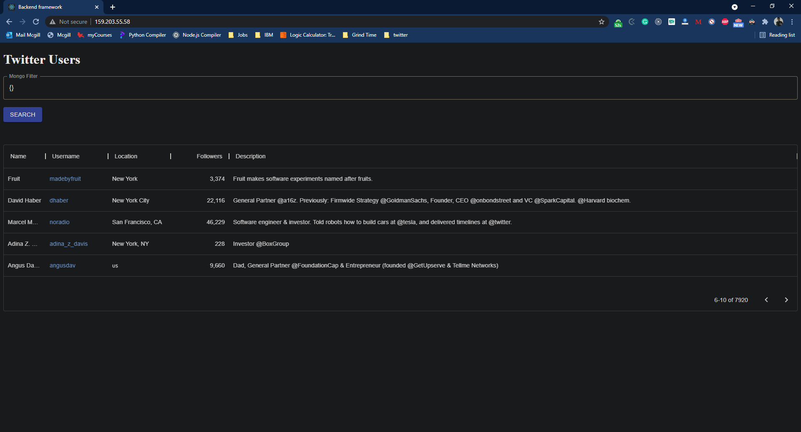
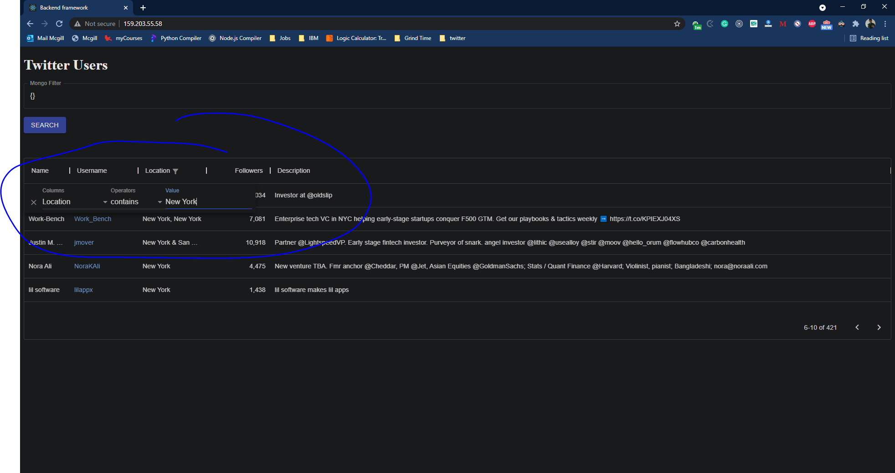
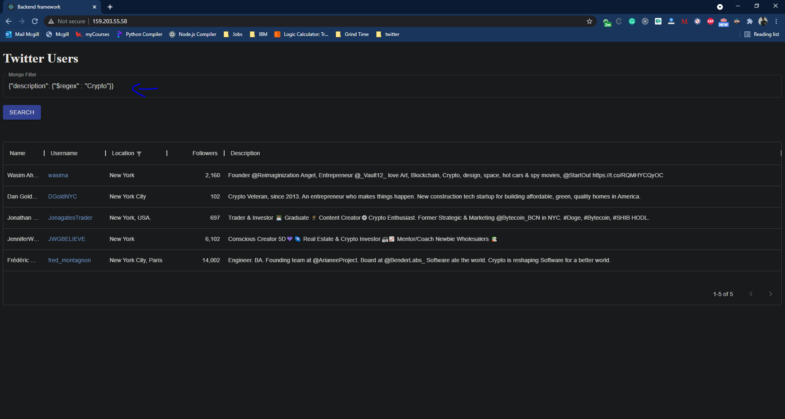

# Description
Twitter bot that will scrape the bio of Twitter users and look for specific keywords will then store the relevant users in a MongoDB database, then recursively add the users to another table to fetch them later.
This project contains a web front end connected to the database, which allows accessing all of the users added in the database and filter
them down by sending a filter requests to the MongoDB database.

# What it contains
The repo contains 3 services: `cron service`, `aggregator service` and the `client service`.
- the `cron` service runs a job in the background of the server. This is the service that will fetch, every 3 mins, the Twitter users and add them to the database if they contain the required keywords.
- the `aggregator` service is used to fetch the data from the multiple services and group them together (there's only one service available for now other than the front end, so this service is redundant)
- the `client` service is the front end client (react)

# How to setup the project
- First [update the keywords](./app/cron/helper/config.json) that the service is running against, so that it can fetch users with any customized keywords. 
- Then setup a mongodb instance, after which you need to manually add the first user that will serve as root.
- Then you need a kubernetes cluster setup to deploy the project, once it's setup, change the public URLs in the project to link to your cluster. You need to change it in the [portal.js](./app/client/src/component/portal.js) file and the [internal-request.js](app/aggregator/axios/internal-requests.js) file
- Add your twitter bearer auth token in the [fetch-users.js](app/cron/helper/fetch-users.js) file
- Lastly build and deloy the images to docker hub and run the kubernetes deployments.

# run the project:
1. Build the images
```shell
cd ./app/cron
docker build --tag <docker-id>/cron-service:latest . && docker push <docker-id>/cron-service:latest
cd /app/aggregator
docker build --tag <docker-id>/aggregator-service:latest . && docker push <docker-id>/aggregator-service:latest
cd /app/client
docker build --tag <docker-id>/twitter-client:latest . && docker push <docker-id>/twitter-client:latest
```
2. run the kubernetes deployments
```shell
cd /k8s
kubectl apply -f ./cron-k8s/cron-deployment.yaml
cd /k8s
kubectl apply -f ./aggregator-k8s/aggregator-deployment.yaml
```
3. Setup Ingress Nginx
```shell
cd /k8s
kubectl apply -f ./ingress/ingress-controller.yaml
```
4. run the react app
```shell
cd /k8s
kubectl apply -f ./twitter-client-k8s/client-deployment.yaml
```
# Accessing the data
The React allows to access the data directly from the web page:

If you want to run some simple filter, you can run them directly from the react table:

If you want to run more advanced filters, you can run advanced mongoDB filter in the prompt:
